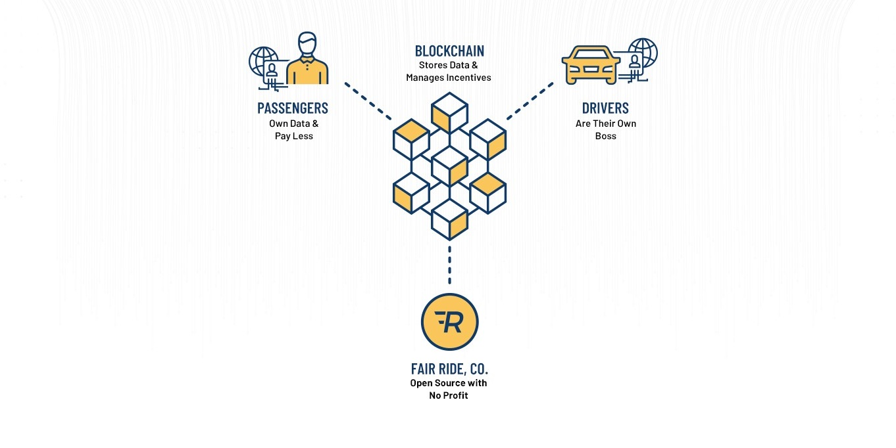

# A blockchain-based network to reduce the travel cost in the Ride-Sharing service

Master's thesis by **Mehran Mazhar** · Thesis advisor: MohammadHossein ShafiAbadi, Ph.D.

ارائه یک شبکه مبتنی بر بلاکچین برای کاهش هزینه سفر در سرویس اشتراک گذاری سفر

> **🚀 This research became a real system:** the ideas in this thesis grew into [**Clutch Protocol**](https://github.com/clutchprotocol) — an open-source ride-sharing blockchain written in Rust, with a [live testnet demo](https://app-stage.clutchprotocol.io) you can try in the browser.

📄 [Thesis (PDF)](MehranMazhar_Thesis.pdf) · 🎞 [Defense presentation (PDF)](MehranMazhar_Thesis_Presentation.pdf)

-Current Ride-Share model

-Blockchain-based Ride-Share model
 
